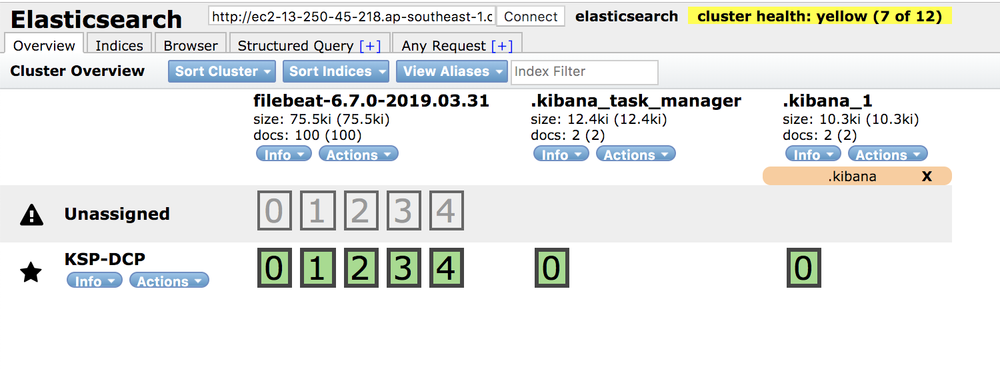
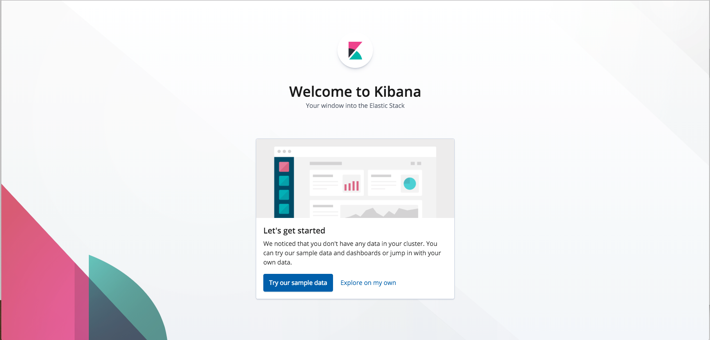
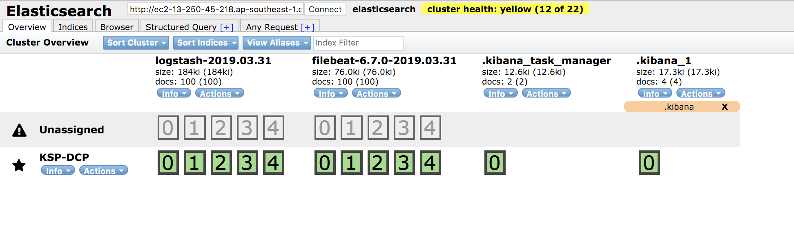
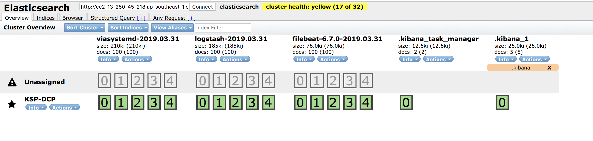
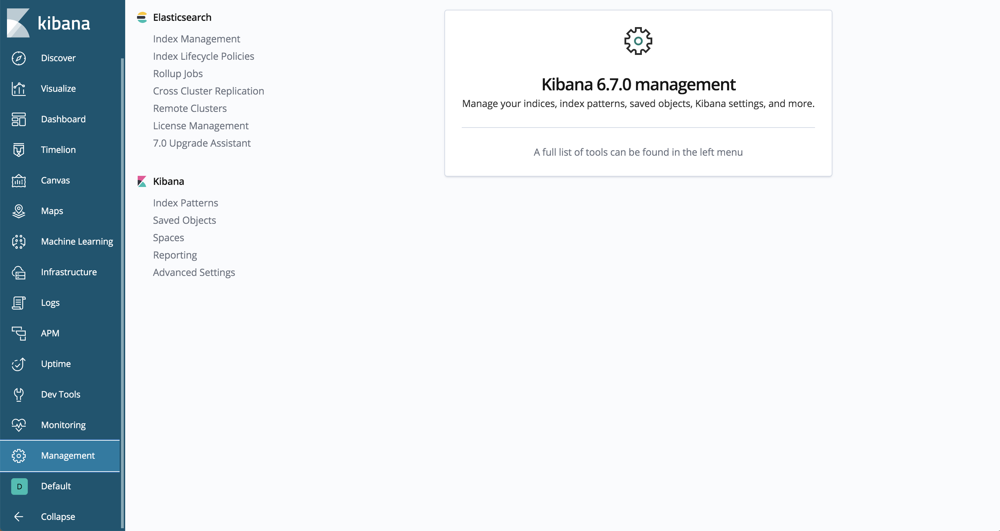
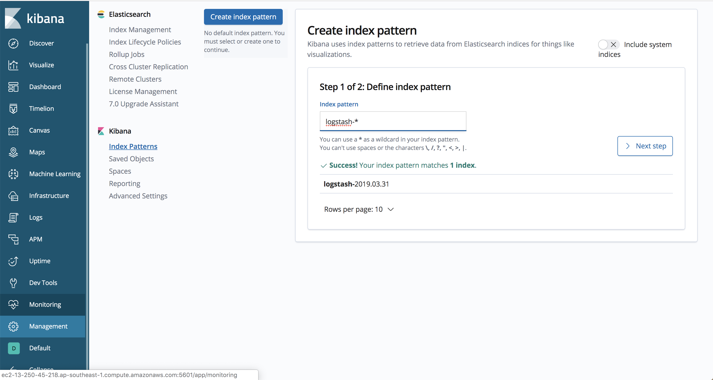
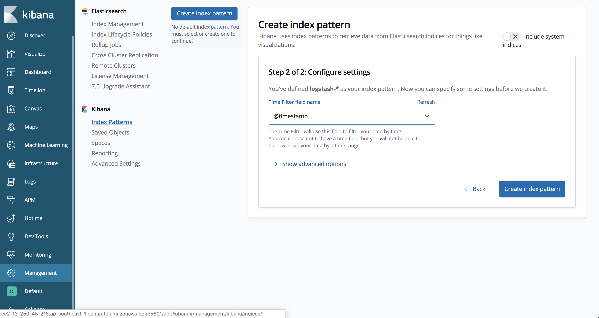
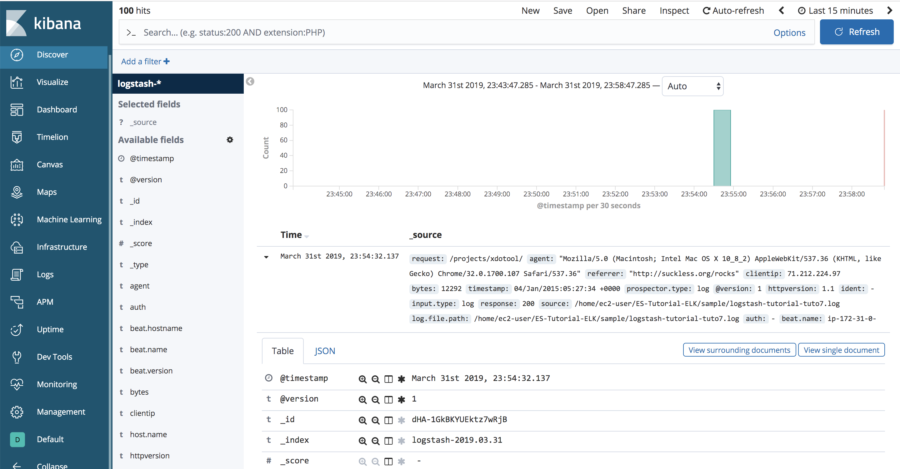

# ELK Stack Tutorial(Elasticsearch Logstash Kibana)

ElasticSearch ELK 튜토리얼을 기술합니다.

본 스크립트는 외부 공인망을 기준으로 작성되었습니다.

본 튜토리얼은 Elastic Evangelist 김종민님의 [웨비나](https://www.elastic.co/kr/webinars/getting-started-logstash)를 참고하여 작성하였습니다.

8GB 이상의 메모리가 확보된 시스템에서 실행을 권고합니다.

## Product 별 버전 상세
```
Latest ELK Version. 6.7.0(2019/04/01 기준 Latest Ver.)
```
* [Elasticsearch](https://artifacts.elastic.co/downloads/elasticsearch/elasticsearch-6.7.0.tar.gz)
* [Logstash](https://artifacts.elastic.co/downloads/logstash/logstash-6.7.0.tar.gz)
* [Kibana](https://artifacts.elastic.co/downloads/kibana/kibana-6.7.0-x86_64.tar.gz)
* [Filebeat](https://artifacts.elastic.co/downloads/beats/filebeat/filebeat-6.7.0-x86_64.tar.gz)

최신 버전은 [Elasticsearch 공식 홈페이지](https://www.elastic.co/downloads) 에서 다운로드 가능합니다.

## ELK Tutorial 준비

이 튜토리얼에서는 tar.gz 파일을 이용하여 실습합니다.
설치는 non-root 계정으로 설치합니다.
linux 배포판에 대해 패키지 설치를 지원합니다.

```bash
[ec2-user@ip-xxx-xxx-xxx-xxx ~]$ sudo yum -y install git

[ec2-user@ip-xxx-xxx-xxx-xxx ~]$ git clone https://github.com/benjamin-btn/ES-Tutorial-ELK.git

[ec2-user@ip-xxx-xxx-xxx-xxx ~]$ cd ES-Tutorial-ELK

[ec2-user@ip-xxx-xxx-xxx-xxx ES-Tutorial-ELK]$ ./tuto
##################### Menu ##############
 $ ./tuto [Command]
#####################%%%%%%##############
         1 : install elk packages
         2 : set elk
         3 : standard input/output, no filters
         4 : standard input/output, simple filter
         5 : beats input, no filter, standard output
         6 : beats input, grok filter COMBINEDAPACHELOG, standard output
         7 : beats input, grok filter COMBINEDAPACHELOG, es output
         8 : beats input, grok filter COMBINEDAPACHELOG, es output with systemd
#########################################
```

## ELK Tutorial 1~2 - Elasticsearch, Kibana, Filebeat 세팅

```bash
[ec2-user@ip-xxx-xxx-xxx-xxx ES-Tutorial-ELK]$ ./tuto 1

[ec2-user@ip-xxx-xxx-xxx-xxx ~]$ cd ES-Tutorial-ELK

[ec2-user@ip-xxx-xxx-xxx-xxx ES-Tutorial-ELK]$ ./tuto 2
```

/etc/security/limits/conf 수정사항을 반영하기 위해 ./tuto 1 에서 sudo su - ec2-user 를 하였습니다.

home directory 로 돌아가기 때문에 다시 튜토리얼 디렉토리로 위치를 변경시켜 ./tuto 2 를 실행시켜줍니다.

### Elasticsearch
* packages/elasticsearch/config/elasticsearch.yml
  - network.host, http.cors.enabled, http.cors.allow-origin 만 설정

* packages/elasticsearch/config/jvm.options
  - Xms1g, Xmx1g 를 물리 메모리의 절반으로 수정

```bash
[ec2-user@ip-xxx-xxx-xxx-xxx ES-Tutorial-ELK]$ vi packages/elasticsearch/config/elasticsearch.yml
network.host: 0.0.0.0
http.cors.enabled: true
http.cors.allow-origin: "*"

[ec2-user@ip-xxx-xxx-xxx-xxx ES-Tutorial-ELK]$ vi packages/elasticsearch/config/jvm.options
-Xms4g
-Xmx4g
```

### Kibana
* packages/kibana/config/kibana.yml
  - server.host: "0.0.0.0" -> 외부에서 접근 가능하도록 변경
  - elasticsearch.url: "http://localhost:9200" -> 주석해제
  - kibana.index: ".kibana" -> 주석해제

```bash
[ec2-user@ip-xxx-xxx-xxx-xxx ES-Tutorial-ELK]$ vi packages/kibana/config/kibana.yml
server.host: "0.0.0.0"
elasticsearch.url: "http://localhost:9200"
kibana.index: ".kibana"
```

### Filebeat
* packages/filebeat/config/filebeat.yml
  - /home/ec2-user/ES-Tutorial-ELK/sample/ 밑에 .log 파일을 스트리밍 하도록 추가
  - output.elasticsearch: 에 hosts: ["localhost:9200"] 추가

```bash
[ec2-user@ip-xxx-xxx-xxx-xxx ES-Tutorial-ELK]$ vi packages/filebeat/config/filebeat.yml
filebeat.inputs:
- type: log
  enabled: true
  paths:
    - /home/ec2-user/ES-Tutorial-ELK/sample/*.log
output.elasticsearch:
  hosts: ["localhost:9200"]
```

## Smoke Test

### Elasticsearch

```bash
[ec2-user@ip-xxx-xxx-xxx-xxx ES-Tutorial-ELK]$ curl localhost:9200
{
  "name" : "KSP-DCP",
  "cluster_name" : "elasticsearch",
  "cluster_uuid" : "rR30tBrtTl6LDq4nkzapxA",
  "version" : {
    "number" : "6.7.0",
    "build_flavor" : "default",
    "build_type" : "tar",
    "build_hash" : "8453f77",
    "build_date" : "2019-03-21T15:32:29.844721Z",
    "build_snapshot" : false,
    "lucene_version" : "7.7.0",
    "minimum_wire_compatibility_version" : "5.6.0",
    "minimum_index_compatibility_version" : "5.0.0"
  },
  "tagline" : "You Know, for Search"
}

$ curl -H 'Content-Type: application/json' -XPOST localhost:9200/firstindex/_doc -d '{ "mykey": "myvalue" }'
```
* Web Browser 에 [http://ec2-52-221-155-168.ap-southeast-1.compute.amazonaws.com:9100/index.html?base_uri=http://{FQDN}:9200](http://ec2-52-221-155-168.ap-southeast-1.compute.amazonaws.com:9100/index.html?base_uri=http://FQDN:9200) 실행



### Kibana
* Web Browser 에 [http://{FQDN}:5601](http://{FQDN}:5601) 실행



### Filebeat
* Process 확인 및 Elasticsearch 에 filebeat 인덱스 생성 여부 확인
  - http://es-head.is.daumkakao.io:9100/index.html?base_uri=http://{FQDN}:9200


## ELK Tutorial 3~8 - Logstash 활용

### tuto 3. filter 없이 standard input 을 logstash 가 받아 standard output 으로 출력
packages/logstash/bin/logstash -e 'input { stdin { } } output { stdout {} }'

```bash
[ec2-user@ip-xxx-xxx-xxx-xxx ES-Tutorial-ELK]$ ./tuto 3
[2019-03-31T14:07:08,465][INFO ][logstash.agent           ] Successfully started Logstash API endpoint {:port=>9600}
Hello benjamin
/home/ec2-user/ES-Tutorial-ELK/packages/logstash-6.7.0/vendor/bundle/jruby/2.5.0/gems/awesome_print-1.7.0/lib/awesome_print/formatters/base_formatter.rb:31: warning: constant ::Fixnum is deprecated
{
    "@timestamp" => 2019-03-31T14:27:30.761Z,
      "@version" => "1",
       "message" => "Hello benjamin",
          "host" => "ip-172-31-0-154.ap-southeast-1.compute.internal"
}
```
정상적으로 시작되었으면 Hello benjamin 이라고 텍스트를 입력

ctrl+c 로 ./tuto 3 중단

### tuto 4. grok filter 활용, Hello 뒤에 나오는 이름에 name key 를 매칭
packages/logstash/bin/logstash -f logstash_conf/simple.conf

```bash
[ec2-user@ip-xxx-xxx-xxx-xxx ES-Tutorial-ELK]$ ./tuto 4
[2019-03-31T14:30:22,561][INFO ][logstash.agent           ] Successfully started Logstash API endpoint {:port=>9600}
Hello benjamin
/home/ec2-user/ES-Tutorial-ELK/packages/logstash-6.7.0/vendor/bundle/jruby/2.5.0/gems/awesome_print-1.7.0/lib/awesome_print/formatters/base_formatter.rb:31: warning: constant ::Fixnum is deprecated
{
          "host" => "ip-172-31-0-154.ap-southeast-1.compute.internal",
       "message" => "Hello benjamin",
          "name" => "benjamin",
      "@version" => "1",
    "@timestamp" => 2019-03-31T14:30:27.454Z
```
정상적으로 시작되었으면 Hello benjamin 이라고 텍스트를 입력

ctrl+c 로 ./tuto 4 중단

### tuto 5. input 에 beats 정의, filter 없이 rubydebug codec 을 통해 standard output 으로 출력
packages/logstash/bin/logstash -f logstash_conf/beats.conf

conf/filebeat.yml_tuto2 를 통해 파일비트가 logstash 를 output 으로 스트리밍 진행

```bash
[ec2-user@ip-xxx-xxx-xxx-xxx ES-Tutorial-ELK]$ ./tuto 5
[2019-03-31T14:35:26,928][INFO ][logstash.agent           ] Successfully started Logstash API endpoint {:port=>9600}

[ec2-user@ip-xxx-xxx-xxx-xxx ES-Tutorial-ELK]$ cp /home/ec2-user/ES-Tutorial-ELK/sample/logstash-tutorial.log /home/ec2-user/ES-Tutorial-ELK/sample/logstash-tutorial-tuto5.log
...
       "message" => "218.30.103.62 - - [04/Jan/2015:05:28:21 +0000] \"GET /blog/productivity/better-zsh-xterm-title-fix.html HTTP/1.1\" 200 10185 \"-\" \"Sogou web spider/4.0(+http://www.sogou.com/docs/help/webmasters.htm#07)\"",
...
    "@timestamp" => 2019-03-31T14:41:52.086Z,
          "beat" => {
            "name" => "ip-172-31-0-154.ap-southeast-1.compute.internal",
         "version" => "6.7.0",
        "hostname" => "ip-172-31-0-154.ap-southeast-1.compute.internal"
    },
      "@version" => "1"
}

```

다른 터미널로 서버 접속 후 파일비트가 로그를 추가로 스트리밍 할 수 있도록 로그파일 복사

ctrl+c 로 ./tuto 5 중단

### tuto 6. input 에 beats 정의, grok filter 를 통해 COMBINEDAPACHELOG 로 message 필터링, rubydebug codec 을 통해 standard output 으로 출력
packages/logstash/bin/logstash -f logstash_conf/apache.conf

```bash
[ec2-user@ip-xxx-xxx-xxx-xxx ES-Tutorial-ELK]$ ./tuto 6
[2019-03-31T14:35:26,928][INFO ][logstash.agent           ] Successfully started Logstash API endpoint {:port=>9600}

[ec2-user@ip-xxx-xxx-xxx-xxx ES-Tutorial-ELK]$ cp /home/ec2-user/ES-Tutorial-ELK/sample/logstash-tutorial.log /home/ec2-user/ES-Tutorial-ELK/sample/logstash-tutorial-tuto6.log
...
       "clientip" => "86.1.76.62",
           "host" => {
        "name" => "ip-172-31-0-154.ap-southeast-1.compute.internal"
    },
    "httpversion" => "1.1",
     "@timestamp" => 2019-03-31T14:47:22.116Z,
           "verb" => "GET"

```

다른 터미널로 서버 접속 후 파일비트가 로그를 추가로 스트리밍 할 수 있도록 로그파일 복사

message 영역이 grok filter 에 의해 유의미한 필드들로 나뉨

ctrl+c 로 ./tuto 6 중단

### tuto 7. input 에 beats 정의, grok filter 를 통해 COMBINEDAPACHELOG 로 message 필터링, rubydebug codec 을 통해 standard output 으로 출력과 동시에 ES 에 저장
packages/logstash/bin/logstash -f logstash_conf/es.conf

```bash
[ec2-user@ip-xxx-xxx-xxx-xxx ES-Tutorial-ELK]$ ./tuto 7
[2019-03-31T14:35:26,928][INFO ][logstash.agent           ] Successfully started Logstash API endpoint {:port=>9600}

[ec2-user@ip-xxx-xxx-xxx-xxx ES-Tutorial-ELK]$ cp /home/ec2-user/ES-Tutorial-ELK/sample/logstash-tutorial.log /home/ec2-user/ES-Tutorial-ELK/sample/logstash-tutorial-tuto7.log
...
       "clientip" => "86.1.76.62",
          "bytes" => "4877",
      "timestamp" => "04/Jan/2015:05:30:37 +0000",
     "prospector" => {
        "type" => "log"

```

다른 터미널로 서버 접속 후 파일비트가 로그를 추가로 스트리밍 할 수 있도록 로그파일 복사

ES 에 logstash-xxxx.xx.xx 인덱스 추가 확인



ctrl+c 로 ./tuto 7 중단

### tuto 8. systemd 를 통한 logstash service
packages/logstash/config/logstash.yml
  * config.reload.automatic: true -> 3s 주석해제 및 true 설정
  * config.reload.interval: 3s -> 주석해제

packages/logstash/config/pipelines.yml
  * pipeline.id: my-pipe -> 주석해제 및 pipeline id 수정
  * path.config: "/home/ec2-user/ES-Tutorial-ELK/packages/logstash/config/\*.conf" -> 주석해제 및 conf 설정

```bash
[ec2-user@ip-xxx-xxx-xxx-xxx ES-Tutorial-ELK]$ ./tuto 8

[ec2-user@ip-xxx-xxx-xxx-xxx ES-Tutorial-ELK]$ cp /home/ec2-user/ES-Tutorial-ELK/sample/logstash-tutorial.log /home/ec2-user/ES-Tutorial-ELK/sample/logstash-tutorial-tuto8.log
```

다른 터미널로 서버 접속 후 파일비트가 로그를 추가로 스트리밍 할 수 있도록 로그파일 복사

systemd 에 등록하여 대몬으로 유지, viasystemd-xxxx.xx.xx 인덱스 생성 확인



> [logstash patterns](https://github.com/logstash-plugins/logstash-patterns-core/tree/master/patterns) 를 사용하여 filter 를 정의
> [logstash plugins](https://github.com/logstash-plugins) 를 사용하여 inputs, filters, outputs 를 정의

## ELK Tutorial - Kibana 활용
키바나 인덱스 패턴 만들기


Kibana Management 메뉴 선택


Kibana Index Patterns 선택 후 인덱스 이름 설정(logstash-\*)


timestamp 설정 후 인덱스 패턴 생성


Kibana Discovery 에서 해당 패턴으로 문서 확인
